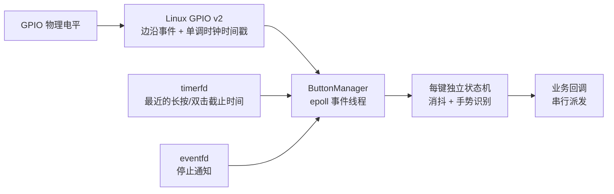

# GPIO Button 模块详细说明

## 1. 模块概述

GPIO Button 是一个面向 Linux 嵌入式设备的 C++23 按键输入模块，提供以下事件：

- `Press`：有效按下；
- `Release`：有效释放；
- `Click`：未达到长按阈值的短按；
- `DoubleClick`：两个短按的释放时间落在双击窗口内；
- `LongPress`：持续按下达到长按阈值。

模块直接使用 Linux GPIO character-device v2 ioctl，不依赖 libgpiod 或 pkg-config。GPIO 边沿、长按定时器和停止通知统一进入一个 `epoll` 事件循环，空闲时线程阻塞，不轮询 GPIO。

当前实现已经完成：

- ARM 32 位 hard-float 交叉编译；
- 主机侧状态机测试；
- 目标板 GPIO 按键功能验证。

本文档以当前源码为准，不承诺具体目标板上的绝对响应时间；响应延迟仍会受到 Linux 调度、业务回调耗时和硬件抖动影响。

## 2. 运行环境和约束

### 2.1 软件要求

- C++23 编译器；
- Linux GPIO character-device v2 用户态接口；
- 工具链头文件包含 `linux/gpio.h`；
- 目标板内核支持 `GPIO_V2_GET_LINE_IOCTL`；
- 目标系统存在 `/dev/gpiochipN` 设备节点；
- 运行用户有权打开对应的 gpiochip。

### 2.2 硬件和设备树要求

- 管脚 pinmux 必须配置成 GPIO；
- 输入必须有稳定的上拉或下拉，来源可以是外部电阻、SoC 内部 bias 或设备树配置；
- 管脚不能同时被 `gpio-keys`、LED、UART、PWM 等其他内核驱动占用；
- `active_low` 必须与实际按键接法一致。

模块只请求输入和双边沿事件，不通过 ioctl 设置上拉、下拉或硬件消抖。因此电气偏置和 pinmux 属于板级配置责任。

## 3. 源码结构

| 文件 | 责任 |
| --- | --- |
| `src/gpio_button/button.hpp` | 对外公开的数据类型、配置和 `ButtonManager` 接口。 |
| `src/gpio_button/button_state_machine.hpp/.cpp` | 与 Linux 无关的按键状态机，负责消抖、单击、双击和长按判定。 |
| `src/gpio_button/button_manager_linux.cpp` | Linux GPIO v2、`epoll`、`timerfd`、`eventfd` 和工作线程。 |
| `src/gpio_button/CMakeLists.txt` | 构建 `gpio_button_core` 和 `gpio_button_linux` 静态库。 |
| `src/main.cpp` | 单按键接入示例及安全退出示例。 |
| `src/tests/button_state_machine_tests.cpp` | 无 GPIO 硬件依赖的状态机测试。 |

模块分为两层：

- `gpio_button_core`：纯 C++ 状态机，可在 Windows 主机测试；
- `gpio_button_linux`：Linux GPIO 后端，依赖内核头文件和 POSIX API，并链接 `gpio_button_core`。

## 4. 数据流和线程模型



`ButtonManager::start()` 在调用线程中完成设备申请，然后创建一个 `std::jthread`。该线程是模块唯一的事件采集和回调派发线程。

事件循环的处理优先级为：

1. 检查停止 `eventfd`，需要停止则退出；
2. 批量读取所有已就绪的 GPIO 边沿；
3. 处理 `timerfd` 到期；
4. 重新计算所有按键中最近的截止时间并重设 `timerfd`。

GPIO 边沿优先于定时器是有意设计。释放边沿恰好落在长按阈值时，状态机会根据内核时间戳补发 `LongPress`，避免将它错误识别成短按。

### 4.1 回调线程约束

所有回调在同一个事件线程中串行执行，业务代码不需要为多个按键回调之间的并发加锁，但回调必须快速返回。

回调中不应执行：

- 阻塞式网络或磁盘 I/O；
- 长时间日志刷新；
- 大量计算；
- 等待其他线程；
- 长时间持有业务互斥锁。

需要执行耗时操作时，应将 `ButtonEvent` 复制到应用自己的队列，由其他工作线程消费。

## 5. 公开 API

公开接口位于 `gpio_button/button.hpp`，命名空间为 `gpio_button`。

### 5.1 时间类型

```cpp
using MonotonicDuration = std::chrono::nanoseconds;
using MonotonicTime =
    std::chrono::time_point<std::chrono::steady_clock, MonotonicDuration>;
```

GPIO 事件时间戳来自内核 `CLOCK_MONOTONIC`。它适合计算事件间隔，但不能直接当作日期或墙上时间打印。

### 5.2 `ButtonConfig`

```cpp
struct ButtonConfig {
    std::string id;
    std::string chip_path{"/dev/gpiochip0"};
    unsigned int line_offset{};
    bool active_low{true};
    MonotonicDuration debounce{std::chrono::milliseconds{25}};
    MonotonicDuration long_press{std::chrono::milliseconds{600}};
    MonotonicDuration double_click_window{std::chrono::milliseconds{250}};
};
```

| 字段 | 含义 | 默认值 |
| --- | --- | --- |
| `id` | 业务侧按键标识；一个管理器内必须唯一且不能为空。 | 无，必须填写 |
| `chip_path` | GPIO character device 路径。 | `/dev/gpiochip0` |
| `line_offset` | gpiochip 内部的 line offset，不是旧 sysfs 全局编号。 | `0` |
| `active_low` | `true` 表示物理低电平为按下。 | `true` |
| `debounce` | 从上一个已接受边沿起的最小有效间隔。 | `25 ms` |
| `long_press` | 按下持续多久产生一次 `LongPress`。 | `600 ms` |
| `double_click_window` | 两次短按释放之间允许的最大间隔。 | `250 ms` |

参数校验规则：

- `id` 和 `chip_path` 不能为空；
- 同一 `ButtonManager` 中的 `id` 必须唯一；
- `debounce` 可以为零，但不能为负；
- `long_press` 和 `double_click_window` 必须大于零；
- 构造参数中至少包含一个按键。

### 5.3 `ButtonEventType`

```cpp
enum class ButtonEventType {
    Press,
    Release,
    Click,
    DoubleClick,
    LongPress,
};
```

`DoubleClick` 是附加事件，不会取代两个 `Click`。如果应用只关心双击，需要自行决定是否忽略此前已经收到的普通点击。

### 5.4 `ButtonEvent`

```cpp
struct ButtonEvent {
    std::string id;
    ButtonEventType type;
    MonotonicTime timestamp;
    MonotonicDuration held_for{};
};
```

| 字段 | 含义 |
| --- | --- |
| `id` | 产生事件的按键 ID。 |
| `type` | 事件类型。 |
| `timestamp` | 单调时钟时间戳；长按事件使用理论长按截止时间。 |
| `held_for` | 当前按压持续时间；`Press` 为零，`Release`/`Click` 为本次实际持续时间。 |

### 5.5 `ButtonManager`

```cpp
ButtonManager(std::vector<ButtonConfig> buttons);
void setCallback(ButtonCallback callback);
void start();
void stop();
bool isRunning() const noexcept;
```

- `setCallback()`：设置或替换回调，可在运行时调用；内部用互斥锁保护回调对象。
- `start()`：同步打开 gpiochip、请求 line、建立 `epoll` 后启动事件线程。失败时抛出异常并释放已取得的资源。
- `stop()`：通过 `eventfd` 唤醒事件线程，等待线程退出并关闭所有 fd；重复调用安全。
- `isRunning()`：返回事件线程的运行标志。

管理器不可复制。析构函数会调用 `stop()`，正常使用无需手工清理 fd；仍建议应用在退出流程中显式调用 `stop()`，使生命周期更清晰。

## 6. 事件语义

### 6.1 短按

一次有效短按产生：

```text
Press -> Release -> Click
```

`Release` 与 `Click` 的 `held_for` 相同。

### 6.2 双击

两次有效短按，且两次释放间隔不超过 `double_click_window`：

```text
Press -> Release -> Click
Press -> Release -> Click -> DoubleClick
```

第一次 `Click` 会立即派发，不等待双击窗口结束；第二次短按也会产生自己的 `Click`，然后额外产生 `DoubleClick`。这样单击延迟最低，但业务层会看到两个点击加一个双击。

### 6.3 长按

按住达到 `long_press`：

```text
Press -> LongPress -> Release
```

`LongPress` 每次按压只产生一次。长按后的释放不会再产生 `Click`，模块也不会自动产生长按重复事件。

如果应用需要“按住连续加减”，应在收到 `LongPress` 后启动应用自己的定时任务，并在收到 `Release` 后停止。

### 6.4 启动时按键已经按下

启动时会通过 `GPIO_V2_LINE_GET_VALUES_IOCTL` 读取初始电平，作为状态机基线，不产生伪 `Press`。

如果程序启动前按键已经按住：

- 不产生 `Press`；
- 不产生 `LongPress`；
- 第一次释放只产生 `Release`；
- 下一次完整按压开始正常识别。

这是因为模块无法知道程序启动前实际按下了多久。

## 7. 消抖策略

当前消抖在用户态状态机中完成，基于内核边沿时间戳：

1. 保存最近一次已接受边沿的时间；
2. 新边沿与它状态相同，直接忽略；
3. 新边沿距离上次已接受边沿小于 `debounce`，直接忽略；
4. 其余边沿更新稳定状态并产生事件。

默认 `25 ms` 适用于常见机械按键。过短会增加误触风险，过长会吞掉非常快速的真实点击。若按键硬件抖动严重，应优先检查上拉/下拉、走线和接地，再调整软件阈值。

模块没有设置 GPIO v2 的 `GPIO_V2_LINE_ATTR_ID_DEBOUNCE`，因此不依赖具体 GPIO 控制器是否支持内核硬件消抖。

## 8. Linux GPIO v2 实现

### 8.1 初始化过程

每个按键当前使用一个独立 GPIO line request：

1. `open(chip_path, O_RDONLY | O_CLOEXEC)`；
2. 填充 `gpio_v2_line_request`；
3. 设置 `INPUT | EDGE_RISING | EDGE_FALLING`；
4. 通过 `GPIO_V2_GET_LINE_IOCTL` 请求 line；
5. 将返回的匿名 line fd 设置为非阻塞和 close-on-exec；
6. 使用 `GPIO_V2_LINE_GET_VALUES_IOCTL` 读取初始物理电平；
7. 将 line fd 注册到 `epoll`。

内核事件缓冲建议值为 64 条，用户态每批最多读取 32 条，并持续读取到 `EAGAIN`，用于吸收机械抖动或多事件积压。

### 8.2 `active_low` 处理

GPIO request 没有设置 `GPIO_V2_LINE_FLAG_ACTIVE_LOW`，事件仍表示物理上升沿和下降沿。模块在 C++ 层进行转换：

```cpp
pressed = active_low ? !physical_level_high : physical_level_high;
```

这样初始电平和边沿事件使用同一套极性规则，便于测试，也避免混淆内核“active/inactive”与物理高低电平。

### 8.3 定时器管理

一个 `timerfd` 服务所有按键。每次处理完事件后，管理器遍历所有状态机，选择最早的：

- 长按截止时间；
- 双击窗口清理时间。

然后用 `TFD_TIMER_ABSTIME` 设置绝对单调时钟截止点。没有待处理截止时间时，`timerfd` 被解除，事件线程只等待 GPIO 或停止通知。

## 9. GPIO1_D1 接入示例

当前 `main.cpp` 使用 GPIO1_D1：

```cpp
gpio_button::ButtonConfig button{
    .id = "user-button",
    .chip_path = "/dev/gpiochip1",
    .line_offset = 25,
    .active_low = true,
};
```

Rockchip bank 内部通常按 A/B/C/D 各 8 根排列：

```text
D1 offset = 3 * 8 + 1 = 25
```

这里必须使用 gpiochip 内 offset `25`。旧 sysfs 全局编号 `57 = 1 * 32 + 25` 不适用于本模块。

`/dev/gpiochip1` 是否确实对应 GPIO1 bank，应在目标系统确认：

```sh
ls -l /dev/gpiochip*
cat /sys/kernel/debug/gpio
```

读取 debugfs 通常需要 root，并且系统必须挂载 debugfs。

## 10. 多按键示例

```cpp
std::vector<gpio_button::ButtonConfig> configs{
    {
        .id = "confirm",
        .chip_path = "/dev/gpiochip1",
        .line_offset = 25,
        .active_low = true,
    },
    {
        .id = "back",
        .chip_path = "/dev/gpiochip1",
        .line_offset = 26,
        .active_low = true,
        .debounce = std::chrono::milliseconds{30},
        .long_press = std::chrono::milliseconds{800},
        .double_click_window = std::chrono::milliseconds{300},
    },
};

gpio_button::ButtonManager manager(std::move(configs));
manager.setCallback([](const gpio_button::ButtonEvent& event) {
    // 根据 event.id 和 event.type 分发业务。
});
manager.start();
```

同一个 gpiochip 上的多个按键目前仍分别打开 chip 并分别申请 line。这简化了每键配置和事件归属；若未来按键数量很多，可考虑按 gpiochip 合并 line request。

## 11. 构建与测试

### 11.1 VS Code ARM 构建

项目的 `.vscode/settings.json` 已指定 `MinGW Makefiles` 和 ARM 平台。执行：

1. `CMake: Delete Cache and Reconfigure`；
2. `CMake: Build`。

交叉编译不构建主机测试目标。输出文件默认位于：

```text
build/src/example_gpio_button
```

### 11.2 命令行 ARM 构建

```powershell
cmake -S example_gpio_button -B example_gpio_button/build -G "MinGW Makefiles" `
  -DTARGET_PLATFORM=arm-none-linux-gnueabihf `
  -DGPIO_BUTTON_BUILD_TESTS=OFF
cmake --build example_gpio_button/build --parallel
```

### 11.3 主机状态机测试

```powershell
cmake -S example_gpio_button -B build-gpio-tests -G "MinGW Makefiles" `
  -DTARGET_PLATFORM=local `
  -DGPIO_BUTTON_BUILD_APP=OFF
cmake --build build-gpio-tests --parallel
ctest --test-dir build-gpio-tests --output-on-failure
```

当前测试覆盖：

- 抖动边沿过滤和普通点击；
- 恰好达到长按阈值时抑制点击；
- 双击附加事件顺序；
- 双击窗口过期；
- active-low 与 active-high 电平归一化。

## 12. 常见错误和排查

### 12.1 `open(GPIO chip): No such file or directory`

原因通常是 `chip_path` 错误、内核没有启用 GPIO character device，或设备节点未创建。

检查：

```sh
ls -l /dev/gpiochip*
```

### 12.2 `open(GPIO chip): Permission denied`

运行用户没有访问 gpiochip 的权限。可先用 root 验证，再通过 udev 规则或用户组配置正式权限，不建议长期无条件开放所有 GPIO。

### 12.3 `GPIO_V2_GET_LINE_IOCTL: Device or resource busy`

该 line 已被其他进程或内核驱动占用。检查 `/sys/kernel/debug/gpio`，以及设备树中是否同时配置了 `gpio-keys`、LED 或其他外设。

### 12.4 `GPIO_V2_GET_LINE_IOCTL: Invalid argument`

常见原因：

- 目标内核不支持 GPIO uAPI v2；
- line offset 超出该 gpiochip 的范围；
- GPIO 控制器不接受请求的边沿配置；
- 用户态头文件版本明显新于目标内核能力。

### 12.5 没有事件

逐项检查：

- `chip_path` 和 `line_offset` 是否正确；
- pinmux 是否为 GPIO 输入；
- 管脚是否有上拉/下拉；
- `active_low` 是否符合接线；
- 实际电平是否变化；
- line 是否被其他驱动占用。

### 12.6 单次操作产生多个事件

- 先检查输出中是正常的 `Release + Click` 组合，还是出现多个 `Press/Release` 周期；
- 若是真抖动，适当增加 `debounce`；
- 检查接地、线长、电阻和供电噪声；
- 避免在回调中阻塞，使内核事件长时间积压。

## 13. 已知限制

- 仅支持 Linux GPIO character-device v2，不兼容旧 sysfs GPIO 接口；
- 不在模块内配置 pinmux 或 bias；
- 不提供长按自动重复；
- 不支持运行中动态增删按键，需要停止并重建管理器；
- 回调与 GPIO 采集共用同一线程，阻塞回调会增加后续事件延迟；
- 当前没有根据 GPIO `seqno` 检测内核事件丢失；
- 双击采用立即单击策略，因此双击会伴随两个 `Click`；
- 启动时已经按下的按键不会合成长按或点击。

## 14. 维护和扩展建议

修改模块时建议保持以下边界：

- GPIO 获取、fd 生命周期和 `epoll` 留在 Linux 后端；
- 点击语义和时间判定留在纯状态机；
- 菜单、页面切换、消息发送等业务只放在回调消费层；
- 新增手势时优先扩展状态机测试，再接入 Linux 后端；
- 不要用墙上时钟替代单调时钟；
- 不要在事件线程中加入固定周期轮询或 `sleep_for`。

适合后续增加的功能包括：

- 可选长按重复事件；
- 单击延迟确认模式，使双击不再附带普通点击；
- GPIO 事件 `seqno` 连续性检查和丢失恢复；
- 多 line 合并到单个 gpiochip request；
- 可选内核 debounce 属性；
- 应用层无锁或有界事件队列适配器。
