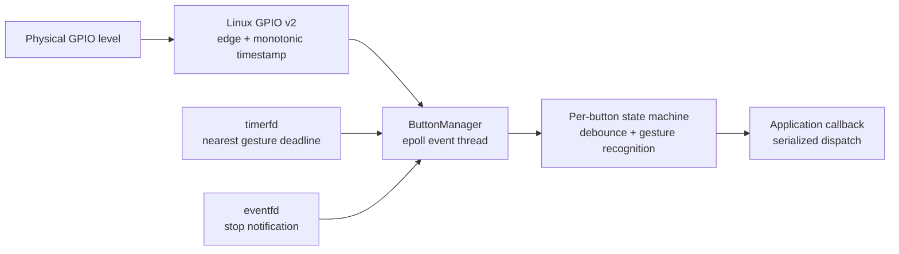

# GPIO Button Module Guide

[中文](gpio-button-module_cn.md) | **English**

## 1. Overview

GPIO Button is a C++23 input module for embedded Linux. It emits:

- `Press`: a validated active press;
- `Release`: a validated release;
- `Click`: a short press below the long-press threshold;
- `DoubleClick`: two short-press releases within the double-click window;
- `LongPress`: a press that reaches the long-press threshold.

It uses the Linux GPIO character-device v2 ioctl API directly, without libgpiod or pkg-config. GPIO edges, long-press deadlines, and stop notification share one `epoll` loop. The worker blocks while idle instead of polling GPIO.

The current implementation has passed ARM32 hard-float cross-compilation, host state-machine tests, and target-board GPIO validation. Absolute response time is not guaranteed because Linux scheduling, callback duration, and hardware bounce still affect latency.

## 2. Runtime requirements and constraints

### 2.1 Software

- A C++23 compiler.
- Linux GPIO character-device v2 userspace support.
- A toolchain whose headers provide `linux/gpio.h`.
- Kernel support for `GPIO_V2_GET_LINE_IOCTL`.
- A `/dev/gpiochipN` node on the target.
- Permission for the runtime user to open that gpiochip.

### 2.2 Hardware and device tree

- Configure the pinmux as GPIO.
- Provide a stable pull-up or pull-down using an external resistor, SoC bias, or the device tree.
- Ensure the line is not also owned by `gpio-keys`, an LED, UART, PWM, or another kernel driver.
- Match `active_low` to the physical circuit.

The module requests input and both edges only. It does not configure bias or hardware debounce through ioctl, so electrical bias and pinmux remain board-level responsibilities.

## 3. Source structure

| File | Responsibility |
| --- | --- |
| `src/gpio_button/button.hpp` | Public types, configuration, and `ButtonManager`. |
| `src/gpio_button/button_state_machine.hpp/.cpp` | Platform-independent debounce, click, double-click, and long-press state machine. |
| `src/gpio_button/button_manager_linux.cpp` | GPIO v2, `epoll`, `timerfd`, `eventfd`, and the worker thread. |
| `src/gpio_button/CMakeLists.txt` | Builds `gpio_button_core` and `gpio_button_linux`. |
| `src/main.cpp` | Single-button integration and clean-shutdown example. |
| `src/tests/button_state_machine_tests.cpp` | State-machine tests with no GPIO dependency. |

The code is split into `gpio_button_core`, which is portable C++ and testable on Windows, and `gpio_button_linux`, which owns the POSIX/kernel backend and links the core.

## 4. Data flow and threading



`ButtonManager::start()` acquires devices in the caller thread and then creates one `std::jthread`. That thread is the sole event collector and callback dispatcher.

The loop processes work in this order:

1. Check the stop `eventfd` and exit when requested.
2. Drain all ready GPIO edges.
3. Process an expired `timerfd`.
4. Recalculate the earliest deadline across all buttons and rearm `timerfd`.

Processing edges before timer expiration is intentional. If a release lands exactly on the long-press threshold, the state machine uses the kernel timestamp to emit the required `LongPress` before classifying the release.

### 4.1 Callback constraints

All callbacks execute serially on the event thread, so callbacks from different buttons do not run concurrently. They must nevertheless return quickly.

Do not perform blocking network/disk I/O, lengthy log flushing, heavy computation, waits for another thread, or long mutex holds in a callback. Copy `ButtonEvent` into an application-owned queue when slower work is required.

## 5. Public API

The interface is in `gpio_button/button.hpp`, namespace `gpio_button`.

### 5.1 Time types

```cpp
using MonotonicDuration = std::chrono::nanoseconds;
using MonotonicTime =
    std::chrono::time_point<std::chrono::steady_clock, MonotonicDuration>;
```

GPIO timestamps use kernel `CLOCK_MONOTONIC`. They are suitable for interval calculations, not calendar or wall-clock display.

### 5.2 `ButtonConfig`

```cpp
struct ButtonConfig {
    std::string id;
    std::string chip_path{"/dev/gpiochip0"};
    unsigned int line_offset{};
    bool active_low{true};
    MonotonicDuration debounce{std::chrono::milliseconds{25}};
    MonotonicDuration long_press{std::chrono::milliseconds{600}};
    MonotonicDuration double_click_window{std::chrono::milliseconds{250}};
};
```

| Field | Meaning | Default |
| --- | --- | --- |
| `id` | Application button ID; non-empty and unique within one manager. | Required |
| `chip_path` | GPIO character-device path. | `/dev/gpiochip0` |
| `line_offset` | Offset inside the gpiochip, not a legacy sysfs global number. | `0` |
| `active_low` | A physical low level means pressed. | `true` |
| `debounce` | Minimum interval from the previous accepted edge. | `25 ms` |
| `long_press` | Hold duration before one `LongPress`. | `600 ms` |
| `double_click_window` | Maximum interval between two short-press releases. | `250 ms` |

IDs and chip paths must be non-empty; IDs must be unique. Debounce may be zero but not negative. Long-press and double-click durations must be positive. A manager requires at least one button.

### 5.3 `ButtonEventType`

```cpp
enum class ButtonEventType {
    Press,
    Release,
    Click,
    DoubleClick,
    LongPress,
};
```

`DoubleClick` is an additional event and does not replace the two `Click` events. An application interested only in double click must decide whether to ignore the ordinary clicks already delivered.

### 5.4 `ButtonEvent`

```cpp
struct ButtonEvent {
    std::string id;
    ButtonEventType type;
    MonotonicTime timestamp;
    MonotonicDuration held_for{};
};
```

| Field | Meaning |
| --- | --- |
| `id` | ID of the source button. |
| `type` | Event type. |
| `timestamp` | Monotonic timestamp; a long press uses its theoretical deadline. |
| `held_for` | Current hold duration; zero for `Press`, actual duration for `Release`/`Click`. |

### 5.5 `ButtonManager`

```cpp
ButtonManager(std::vector<ButtonConfig> buttons);
void setCallback(ButtonCallback callback);
void start();
void stop();
bool isRunning() const noexcept;
```

- `setCallback()` installs or replaces the callback, including while running; a mutex protects the callback object.
- `start()` synchronously opens chips, requests lines, creates `epoll`, and then starts the thread. Failure throws after releasing acquired resources.
- `stop()` wakes the thread through `eventfd`, joins it, and closes all descriptors. Repeated calls are safe.
- `isRunning()` reports the worker's running flag.

The manager is non-copyable. Its destructor calls `stop()`, but explicitly stopping it during application shutdown makes ownership clearer.

## 6. Event semantics

### 6.1 Short press

```text
Press -> Release -> Click
```

`Release` and `Click` carry the same `held_for`.

### 6.2 Double click

Two valid short presses whose release timestamps fit the configured window produce:

```text
Press -> Release -> Click
Press -> Release -> Click -> DoubleClick
```

The first `Click` is dispatched immediately rather than delayed until the window closes. This minimizes single-click latency but means the application sees two clicks plus one double click.

### 6.3 Long press

```text
Press -> LongPress -> Release
```

Only one `LongPress` is emitted per hold. Its release does not emit `Click`, and the module has no built-in key-repeat behavior. For hold-to-repeat, start an application timer on `LongPress` and stop it on `Release`.

### 6.4 Button already held at startup

The manager reads the initial level with `GPIO_V2_LINE_GET_VALUES_IOCTL` and uses it as state-machine baseline without synthesizing `Press`.

If the key was held before startup, no `Press` or `LongPress` is generated, its first release generates only `Release`, and the next complete press is recognized normally. The module cannot know how long the preexisting hold lasted.

## 7. Debounce

The userspace state machine debounces from kernel edge timestamps:

1. Retain the latest accepted edge time.
2. Ignore a new edge that repeats the accepted state.
3. Ignore a new edge closer than `debounce` to the last accepted edge.
4. Otherwise update stable state and emit events.

The default 25 ms suits common mechanical switches. Too little filtering admits bounce; too much can swallow a very fast genuine press. Check bias, wiring, and grounding before increasing it.

The implementation does not set `GPIO_V2_LINE_ATTR_ID_DEBOUNCE`, so it does not depend on controller-specific kernel debounce support.

## 8. Linux GPIO v2 implementation

### 8.1 Initialization

Each button currently receives an independent line request:

1. `open(chip_path, O_RDONLY | O_CLOEXEC)`.
2. Fill `gpio_v2_line_request`.
3. Request `INPUT | EDGE_RISING | EDGE_FALLING`.
4. Call `GPIO_V2_GET_LINE_IOCTL`.
5. Set the returned anonymous line fd non-blocking and close-on-exec.
6. Read the initial physical level with `GPIO_V2_LINE_GET_VALUES_IOCTL`.
7. Register the line fd with `epoll`.

The suggested kernel event buffer is 64 entries. Userspace reads up to 32 events per batch and continues until `EAGAIN`, absorbing switch bounce and temporary event backlogs.

### 8.2 `active_low`

The request deliberately does not set `GPIO_V2_LINE_FLAG_ACTIVE_LOW`; events still identify physical rising and falling edges. C++ normalizes the level:

```cpp
pressed = active_low ? !physical_level_high : physical_level_high;
```

Initial values and edge events therefore share one polarity rule and tests do not confuse kernel “active/inactive” semantics with physical levels.

### 8.3 Timer management

One `timerfd` serves every button. After processing events, the manager selects the earliest long-press deadline or double-click cleanup deadline and arms an absolute monotonic timeout with `TFD_TIMER_ABSTIME`. With no pending deadline, the timer is disarmed and the thread waits only for GPIO or stop notification.

## 9. GPIO1_D1 integration

The current `main.cpp` uses GPIO1_D1:

```cpp
gpio_button::ButtonConfig button{
    .id = "user-button",
    .chip_path = "/dev/gpiochip1",
    .line_offset = 25,
    .active_low = true,
};
```

Rockchip banks commonly divide A/B/C/D into groups of eight:

```text
D1 offset = 3 * 8 + 1 = 25
```

Use the chip-local offset `25`; the legacy sysfs global number `57 = 1 * 32 + 25` is not valid for this module. Confirm that `/dev/gpiochip1` maps to GPIO1 on the actual image:

```sh
ls -l /dev/gpiochip*
cat /sys/kernel/debug/gpio
```

Reading debugfs normally requires root and a mounted debugfs.

## 10. Multiple buttons

```cpp
std::vector<gpio_button::ButtonConfig> configs{
    {
        .id = "confirm",
        .chip_path = "/dev/gpiochip1",
        .line_offset = 25,
        .active_low = true,
    },
    {
        .id = "back",
        .chip_path = "/dev/gpiochip1",
        .line_offset = 26,
        .active_low = true,
        .debounce = std::chrono::milliseconds{30},
        .long_press = std::chrono::milliseconds{800},
        .double_click_window = std::chrono::milliseconds{300},
    },
};

gpio_button::ButtonManager manager(std::move(configs));
manager.setCallback([](const gpio_button::ButtonEvent& event) {
    // Route application behavior by event.id and event.type.
});
manager.start();
```

Buttons on the same chip still open the chip and request a line separately. This keeps per-key configuration and event ownership simple. A future high-key-count implementation can group lines by gpiochip.

## 11. Build and test

### 11.1 VS Code ARM build

`.vscode/settings.json` selects MinGW Makefiles and the ARM target. Run `CMake: Delete Cache and Reconfigure`, then `CMake: Build`. Cross-compilation omits host test targets. The default output is:

```text
build/src/example_gpio_button
```

### 11.2 Command-line ARM build

```powershell
cmake -S example_gpio_button -B example_gpio_button/build -G "MinGW Makefiles" `
  -DTARGET_PLATFORM=arm-none-linux-gnueabihf `
  -DGPIO_BUTTON_BUILD_TESTS=OFF
cmake --build example_gpio_button/build --parallel
```

### 11.3 Host state-machine tests

```powershell
cmake -S example_gpio_button -B build-gpio-tests -G "MinGW Makefiles" `
  -DTARGET_PLATFORM=local `
  -DGPIO_BUTTON_BUILD_APP=OFF
cmake --build build-gpio-tests --parallel
ctest --test-dir build-gpio-tests --output-on-failure
```

Tests cover bounce filtering and ordinary click, click suppression exactly at the long-press threshold, double-click ordering and expiry, and active-low/active-high normalization.

## 12. Troubleshooting

### 12.1 `open(GPIO chip): No such file or directory`

The path is wrong, GPIO character-device support is unavailable, or the node was not created. Inspect `ls -l /dev/gpiochip*`.

### 12.2 `open(GPIO chip): Permission denied`

Validate temporarily as root, then configure a focused udev rule or user group. Do not permanently grant unrestricted GPIO access.

### 12.3 `GPIO_V2_GET_LINE_IOCTL: Device or resource busy`

Another process or kernel driver owns the line. Inspect `/sys/kernel/debug/gpio` and device-tree assignments such as `gpio-keys`, LEDs, and peripherals.

### 12.4 `GPIO_V2_GET_LINE_IOCTL: Invalid argument`

Likely causes are a kernel without GPIO uAPI v2, an out-of-range line offset, unsupported edge configuration, or userspace headers newer than the kernel.

### 12.5 No events

Verify chip path and offset, GPIO input pinmux, pull-up/down, polarity, real voltage transitions, and competing owners.

### 12.6 One action emits several events

First distinguish the expected `Release + Click` pair from repeated `Press/Release` cycles. For real bounce, increase `debounce` moderately and inspect grounding, wire length, pull resistance, and power noise. Avoid blocking callbacks that let kernel events accumulate.

## 13. Known limitations

- Linux GPIO character-device v2 only; legacy sysfs GPIO is unsupported.
- No pinmux or bias configuration.
- No automatic long-press repeat.
- Buttons cannot be added or removed while running; rebuild the manager.
- Callback dispatch shares the acquisition thread, so a blocked callback delays later input.
- GPIO `seqno` is not yet checked for kernel event loss.
- Immediate-click semantics make a double click accompany two `Click` events.
- A button already held at startup cannot become a synthesized long press or click.

## 14. Maintenance and extension

Preserve these boundaries:

- GPIO acquisition, fd lifetime, and `epoll` stay in the Linux backend.
- Gesture semantics and time decisions stay in the portable state machine.
- Menus, navigation, and messaging stay in the callback consumer.
- Add state-machine tests before wiring a new gesture into Linux.
- Keep monotonic time; never substitute wall-clock time.
- Do not introduce periodic polling or `sleep_for` into the event loop.

Good future extensions include optional long-press repeat, delayed single-click confirmation, `seqno` continuity checks and recovery, grouped multi-line requests, optional kernel debounce, and a bounded application event-queue adapter.
