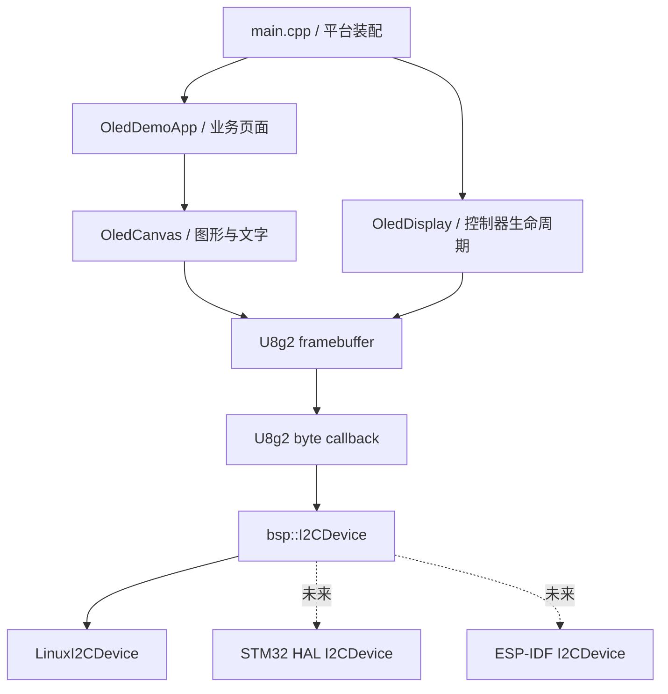
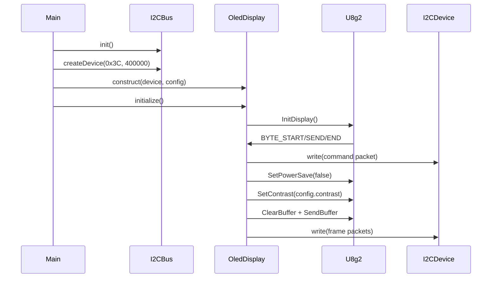

# 架构与运行流程

## 1. 设计目标

工程将 OLED 控制器、绘图业务和平台 I²C 拆开，使同一套页面和绘图代码能够运行在 Linux/Buildroot、STM32 和 ESP32 上。平台代码只负责“把一段字节作为一次 I²C 事务写给指定从机”，控制器初始化、字体和 framebuffer 管理由 U8g2 与显示层负责。

主要原则：

1. `app` 不接触 `/dev/i2c-*`、STM32 HAL 或 ESP-IDF 类型。
2. `display` 不打开设备、不创建线程、不拥有平台总线。
3. `bsp` 不理解字体、图形或 SSD1306 framebuffer。
4. U8g2 是内部实现细节，常规业务通过 `OledCanvas` 绘制。
5. SSD1306 的单色限制由显示业务层用稳定空间抖动处理，不通过高速多帧 PWM 模拟灰度。

## 2. 分层结构



### `app` 层

`OledDemoApp` 持有 `OledDisplay` 引用和一个绑定到显示器 U8g2 上下文的 `OledCanvas`。当前有三种页面：

- `dashboard`：时间、IPv4 地址、CPU 和内存占用率。
- `graphics`：矩形、圆、三角形、圆弧、进度条和文字。
- `grayscale`：多个灰度强度的 Bayer 图案。

`SystemState` 是 Linux 示例业务，不属于 OLED 驱动核心。移植 MCU 时应替换页面数据源，而不是把 `/proc` 解析代码带入 MCU。

### `display` 层

`OledDisplay` 负责：

- 根据 `Controller` 选择 SSD1306 或 SSD1315 U8g2 setup。
- 根据 `Rotation` 配置 U8g2 坐标旋转。
- 初始化控制器、开关显示、省电和对比度。
- 将 U8g2 的 START/SEND/END 消息聚合成单次 I²C 写操作。
- 保存最后一次传输状态。
- 暴露 framebuffer 只读视图用于测试和诊断。

`OledCanvas` 负责：

- 坐标裁剪和整数几何绘制。
- 将 0～255 intensity 转换为 1-bit Bayer 图案。
- 管理 U8g2 字体、UTF-8 绘制和文字宽度测量。
- 处理 XBM 与逐像素灰度位图。

### `bsp` 层

`I2CDevice` 是驱动真正依赖的最小接口。`I2CBus` 和 `I2CDeviceResult` 负责平台侧设备创建；Linux 使用 `std::unique_ptr` 管理打开的设备对象。MCU 可保留相同工厂，也可静态构造一个 `I2CDevice` 实现后直接传给 `OledDisplay`。

Linux BSP 使用 `I2C_RDWR`，每次 `write()` 形成一个完整的 `i2c_msg`。公开地址是 7-bit 地址，例如 `0x3C`，不会要求调用者预先左移。

## 3. 对象生命周期和所有权

推荐创建顺序：

1. 创建并初始化 `I2CBus`。
2. 调用 `createDevice(address, clock_hz)` 获取 `I2CDevice`。
3. 创建 `OledDisplay`，其内部仅保存 `I2CDevice&`，不取得所有权。
4. 调用 `OledDisplay::initialize()`。
5. 从 `nativeHandle()` 创建 `OledCanvas`。
6. 循环执行 `clear()`、业务绘制、`present()`。
7. 退出前可调用 `setPowerSave(true)`。

因此 `I2CDevice` 的生命周期必须长于 `OledDisplay`，`OledDisplay` 又必须长于绑定到它的 `OledCanvas`。这些对象不应被随意移动或跨线程无锁访问。

## 4. 初始化流程



`initialize()` 要求 `delay_ms` 非空；缺失时返回 `invalid_argument`。任何 I²C 写失败都会记录为 `transport_error`，初始化标志不会置位。

## 5. 单帧刷新流程

一次典型帧：

```cpp
display::OledCanvas canvas(oled.nativeHandle());
canvas.clear();
canvas.setFont(display::Font::medium);
canvas.drawText(0, 12, "Hello OLED");
canvas.drawProgressBar(0, 20, 100, 8, 63.0F, 160);

if (oled.present() != display::DisplayStatus::ok) {
    // 记录或恢复 I2C 错误
}
```

绘图只修改 RAM 中的 framebuffer，不立即访问 I²C。`present()` 调用 `u8g2_SendBuffer()` 后，U8g2 通过回调拆分命令和数据。回调使用 64-byte `transfer_buffer_` 聚合每个 U8g2 事务，再调用一次 `I2CDevice::write()`。

## 6. 内存与性能模型

128×64 单色 framebuffer 固定为：

```text
128 × 64 ÷ 8 = 1024 bytes
```

主要常驻 RAM：

| 项目 | 大小 |
| --- | ---: |
| U8g2 全屏 framebuffer | 1024 B |
| `OledCanvas::text_scratch_` | 1024 B |
| I²C 聚合缓冲 | 64 B |
| U8g2 状态和 C++ 对象 | 数百字节 |

单显示器核心通常约占 2.3～3 KB RAM，不包含业务对象、任务栈和平台驱动。`text_scratch_` 用于把文字 glyph 作为蒙版与 Bayer 图案组合；如果产品完全不需要灰度文字，可以在专用 MCU 分支中移除此缓冲并直接调用 U8g2 文本绘制。

在 400 kHz I²C 下，全屏 1024 B 的纯线上时间约为 23 ms，实际还包含控制字节、命令和驱动开销。系统状态页面以 1 Hz 刷新非常宽裕；高帧率动画应评估局部刷新或 SPI。

## 7. 并发与可重入性

当前类没有内部锁。一个显示器应由一个任务独占，或由上层互斥锁保护完整的“清屏—绘制—刷新”区间。不要只给 `present()` 加锁，因为另一个任务仍可能在前一个任务绘制过程中修改 framebuffer。

U8g2 的部分 SSD13xx I²C CAD 实现也包含共享传输状态，因此多显示器、多线程并行刷新必须额外验证。最稳妥的策略是给同一 I²C 总线和所有 U8g2 绘图操作统一串行化。

