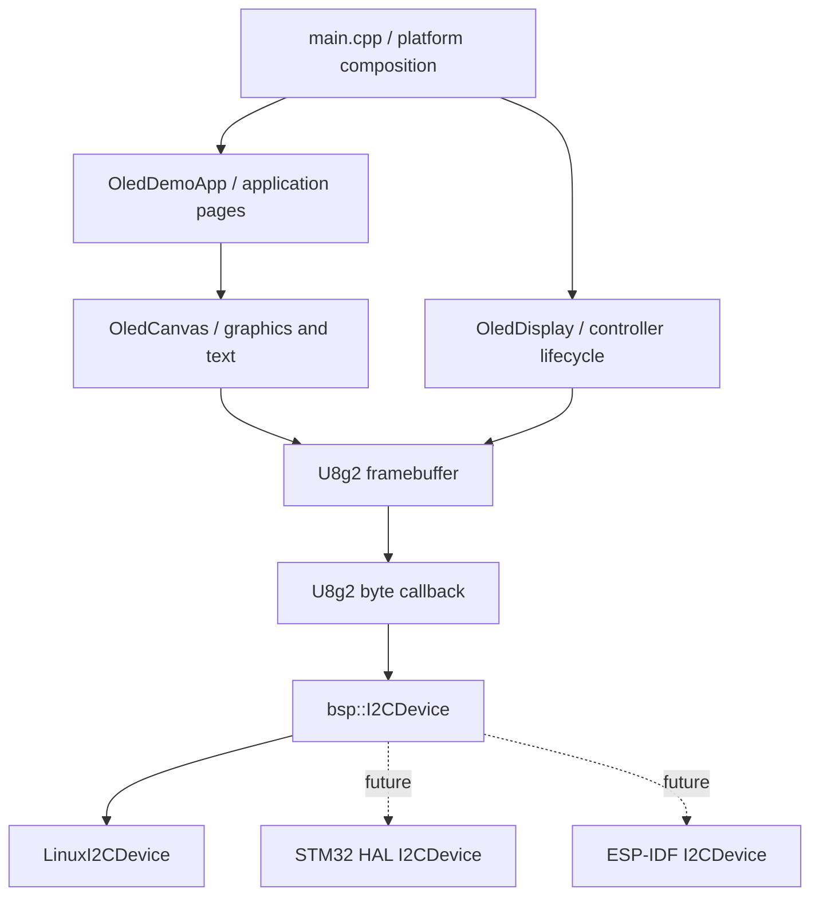
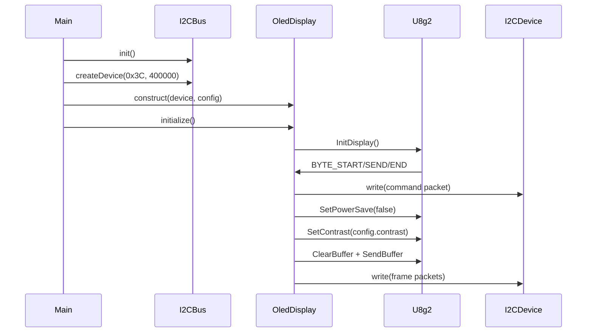

# Architecture and Runtime Flow

[中文](architecture_cn.md) | **English**

## 1. Design goals

The project separates the OLED controller, rendering logic, and platform I²C so the same pages and drawing code can run on Linux/Buildroot, STM32, and ESP32. Platform code is responsible only for writing a byte sequence to a selected slave as one I²C transaction. U8g2 and the display layer own controller initialization, fonts, and framebuffer management.

Core principles:

1. `app` does not use `/dev/i2c-*`, STM32 HAL, or ESP-IDF types.
2. `display` does not open devices, create threads, or own the platform bus.
3. `bsp` does not interpret fonts, graphics, or the SSD1306 framebuffer.
4. U8g2 is an implementation detail; normal application code draws through `OledCanvas`.
5. Stable spatial dithering handles the SSD1306 monochrome limitation. The design does not emulate grayscale with high-rate multi-frame PWM.

## 2. Layered structure



### `app` layer

`OledDemoApp` holds an `OledDisplay` reference and an `OledCanvas` bound to the display's U8g2 context. It currently supplies three pages:

- `dashboard`: time, IPv4 address, CPU utilization, and memory utilization;
- `graphics`: rectangles, circles, triangles, arcs, progress bars, and text;
- `grayscale`: Bayer patterns at several intensity levels.

`SystemState` belongs to the Linux example application, not the OLED driver core. An MCU port should replace the page data source instead of carrying `/proc` parsing into the firmware.

### `display` layer

`OledDisplay` is responsible for:

- selecting the SSD1306 or SSD1315 U8g2 setup from `Controller`;
- applying the U8g2 coordinate rotation from `Rotation`;
- initializing the controller and controlling display output, power save, and contrast;
- aggregating U8g2 START/SEND/END messages into one I²C write;
- retaining the latest transport status;
- exposing a read-only framebuffer view for tests and diagnostics.

`OledCanvas` is responsible for:

- coordinate clipping and integer geometry;
- converting 0–255 intensity to a 1-bit Bayer pattern;
- U8g2 font selection, UTF-8 drawing, and text-width measurement;
- XBM and per-pixel grayscale bitmaps.

### `bsp` layer

`I2CDevice` is the minimal transport interface required by the driver. `I2CBus` and `I2CDeviceResult` create platform devices; the Linux BSP owns an opened device through `std::unique_ptr`. An MCU may retain that factory or statically construct an `I2CDevice` implementation and pass it directly to `OledDisplay`.

The Linux BSP uses `I2C_RDWR`, with each `write()` represented by one complete `i2c_msg`. The public address uses 7-bit semantics such as `0x3C`; callers never left-shift it.

## 3. Object lifetime and ownership

Recommended creation order:

1. Construct and initialize `I2CBus`.
2. Call `createDevice(address, clock_hz)` to obtain `I2CDevice`.
3. Construct `OledDisplay`; it stores only an `I2CDevice&` and does not take ownership.
4. Call `OledDisplay::initialize()`.
5. Construct `OledCanvas` from `nativeHandle()`.
6. Repeatedly call `clear()`, draw the page, and call `present()`.
7. Optionally call `setPowerSave(true)` before shutdown.

`I2CDevice` must therefore outlive `OledDisplay`, and `OledDisplay` must outlive every canvas bound to it. Do not move these objects casually or access them concurrently without synchronization.

## 4. Initialization flow



`initialize()` requires a non-null `delay_ms`; otherwise it returns `invalid_argument`. Any failed I²C write is recorded as `transport_error`, and the initialized flag remains false.

## 5. One-frame refresh flow

A typical frame:

```cpp
display::OledCanvas canvas(oled.nativeHandle());
canvas.clear();
canvas.setFont(display::Font::medium);
canvas.drawText(0, 12, "Hello OLED");
canvas.drawProgressBar(0, 20, 100, 8, 63.0F, 160);

if (oled.present() != display::DisplayStatus::ok) {
    // Record or recover the I2C error.
}
```

Drawing changes only the RAM framebuffer and does not access I²C immediately. `present()` calls `u8g2_SendBuffer()`, after which U8g2 separates commands and data through callbacks. The callback aggregates each U8g2 transaction in the 64-byte `transfer_buffer_` and then calls `I2CDevice::write()` once.

## 6. Memory and performance model

The fixed 128×64 monochrome framebuffer is:

```text
128 × 64 ÷ 8 = 1024 bytes
```

Principal resident allocations:

| Item | Size |
| --- | ---: |
| U8g2 full-screen framebuffer | 1024 B |
| `OledCanvas::text_scratch_` | 1024 B |
| I²C aggregation buffer | 64 B |
| U8g2 state and C++ objects | A few hundred bytes |

One display core normally uses about 2.3–3 KiB of RAM, excluding application state, task stacks, and platform drivers. `text_scratch_` combines a text glyph mask with the Bayer pattern. An MCU product that never needs grayscale text can remove this buffer in its specialized branch and draw text directly with U8g2.

At 400 kHz I²C, the raw wire time for a 1024-byte full frame is about 23 ms, before control bytes, commands, and driver overhead. A 1 Hz dashboard has ample margin; high-frame-rate animation should evaluate partial updates or SPI.

## 7. Concurrency and reentrancy

The classes contain no internal locks. One task should exclusively own a display, or an upper-layer mutex must protect the complete clear–draw–present transaction. Locking only `present()` is insufficient because another task can still modify the framebuffer while the current page is being drawn.

Some SSD13xx I²C CAD implementations in U8g2 also contain shared transfer state. Concurrent refresh of multiple displays from multiple threads requires additional validation. The safest policy is to serialize all U8g2 drawing and all devices on the same I²C bus.
